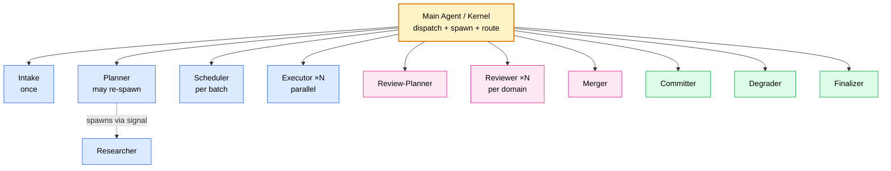
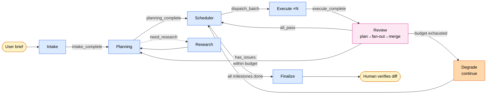
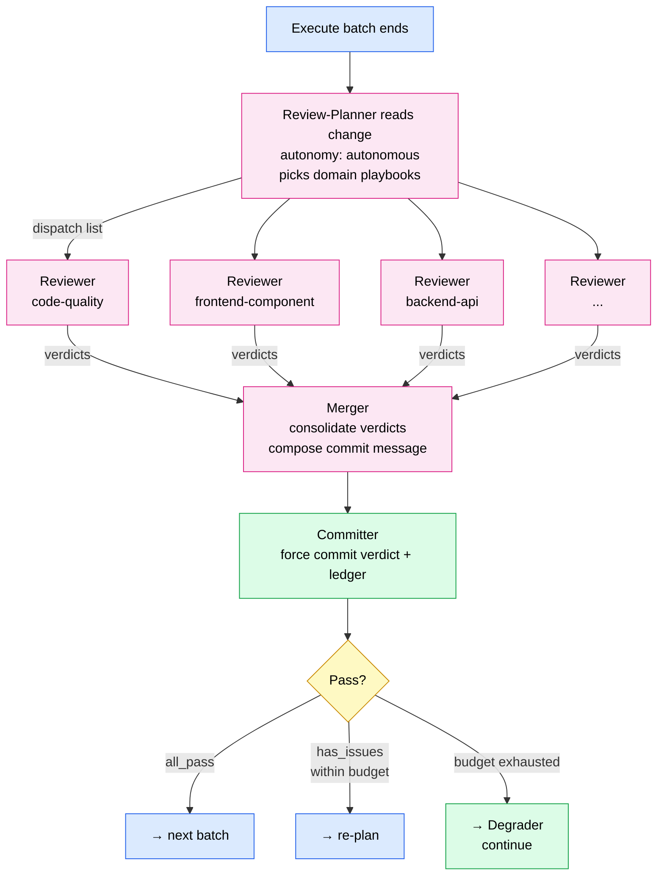
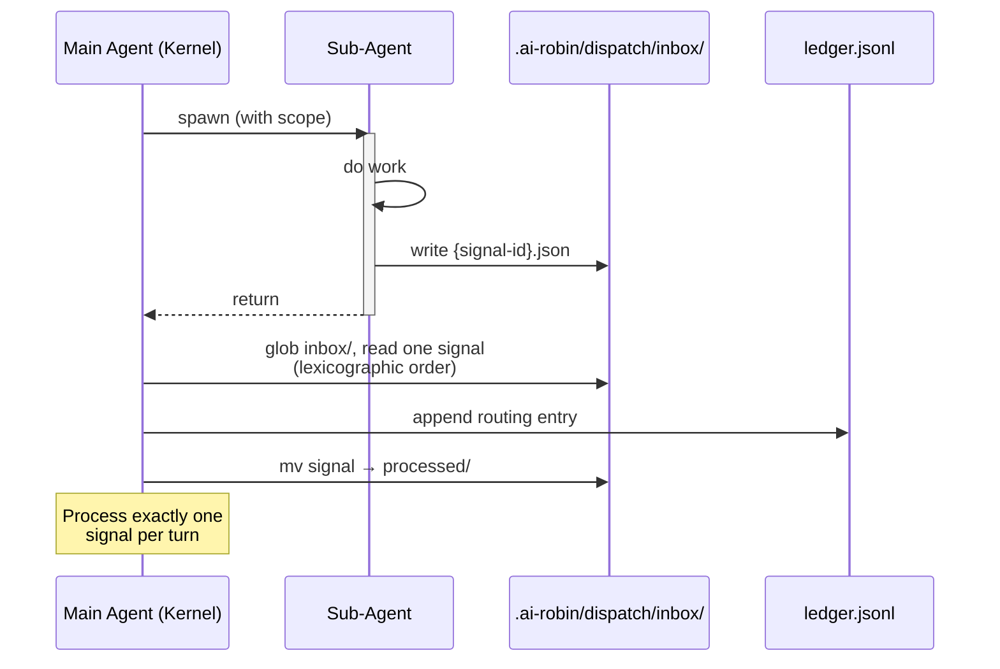

<p align="center">
  English | <a href="./DESIGN.zh-CN.md">简体中文</a>
</p>

# Robin — Design Document

> A natural-language program (NLP) that takes a one-shot human intake and runs an autonomous multi-agent workflow to deliver a software project end to end.

---

## 1. Thesis

Robin is built on a single bet:

> **Human thinking up front + AI running long + human verification at the end** beats **human making tactical decisions at every step.**

This is a P-vs-NP-shaped intuition: verification is cheaper than generation. As long as intake is good enough, an agent framework can drive a project from spec to deliverable without a human in the loop.

Robin is not a helper, not a copilot. It is a **batch job**: drop a brief in, walk away for hours, come back to a project. There is no human in the middle.

---

## 2. Core constraints

The whole design is held up by four hard constraints.

### Constraint 1: Exactly one human interaction

Across the entire project lifecycle, the human only appears in the **Intake** stage. Once Intake returns, the human is gone until the final verification of the deliverable.

Implications:
- **Intake is the life-or-death stage.** Every possible decision point, every gap, every ambiguity must be identified, asked about, or proxied to a decision before Intake returns.
- **Downstream agents have no "stop and ask" affordance.** They have only three exits: decide for themselves, return to an earlier stage to re-plan, or trigger graceful degradation (mark the work incomplete and continue with the rest).
- **Planning, Execute, and Review are autonomous.** All information they depend on must already be frozen into spec by Intake.

### Constraint 2: The main agent is a kernel — always light

The main agent does only three things:
1. **Parse stage transitions** — what stage are we in, what comes next.
2. **Spawn sub-agents** — create sub-agents per dispatch signal, inject the minimum necessary context.
3. **Route return signals** — read each sub-agent's signal, decide the next step.

The main agent **does not make domain judgments** — it does not assess code quality, decide research direction, or compose document content. All substantive work happens in sub-agents; the main agent's context window always has headroom for surprises.

How this is enforced:
- Sub-agents cannot spawn other sub-agents. A sub-agent uses its **return signal** to tell the main agent "I need X"; the main agent does the actual spawn.
- All state lives on disk (spec yaml, session ledger, progress.yaml). The main agent loads only the necessary slice of state at the start of each turn.

### Constraint 3: The doc system reuses Feature Room's data format

Everything Robin writes to disk is **format-compatible with Feature Room**:
- Specs use Feature Room's 7 types (intent / decision / constraint / contract / convention / context / change) + state machine (draft / active / stale / deprecated / superseded) + anchor + provenance / confidence.
- Room directory layout: `room.yaml`, `specs/`, `progress.yaml`, `spec.md`.

But Robin **does not invoke** Feature Room's existing skills (room-init, commit-sync, prompt-gen, etc.). Its own `stdlib/` extracts the methodology (anchor tracking, confidence scoring, state lifecycle, etc.) and rewrites it in Robin's own flavor.

**Why:** Feature Room's skills assume "human is online at every step" (e.g. commit-sync Phase 5 "wait for user confirmation"), which directly conflicts with Constraint 1. But Feature Room's **data model** is excellent and reusable, so Robin keeps the format and replaces the execution.

### Constraint 4: Review is domain-specific

"Code review" is not a single agent doing a single task. It is **a dynamically composed set of domain-specific reviews**, picked by the nature of the change:
- Frontend component review (component API, props, a11y, styling convention)
- Backend API review (endpoint design, error handling, auth)
- DB schema review (indexes, constraints, migration strategy)
- Agent integration review (prompt quality, tool contract, error recovery)
- Code quality review (readability, tests, docs)

Robin's Review layer is **plan-then-fan-out**:
1. **Review-Planner** looks at the change, decides which reviewer sub-agents to spawn.
2. The main agent spawns N reviewers in parallel, each with its own **playbook**.
3. Each reviewer produces a structured verdict.
4. The Merger consolidates verdicts into a pass / fail decision.

Playbooks are **extracted at build time from external skill packages** — e.g. the frontend review playbook is distilled from gstack's frontend review skill, rewritten as a Robin-flavor sub-skill. Robin does not dynamically load external skills at runtime.

---

## 3. Overall architecture

### 3.1 Agent topology



Three kinds of sub-agents:
- **Stage agents** (blue) drive the pipeline: Intake → Planner → Scheduler → Executor, with Researcher as a Planning helper.
- **Review pipeline** (pink) runs after each Executor batch: Review-Planner picks playbooks, parallel Reviewers run them, Merger consolidates.
- **Relief agents** (green) do domain work the kernel cannot do itself: Committer (executes git commits with merger-composed messages), Degrader (writes degradation narratives), Finalizer (composes the end-of-run delivery summary).

### 3.2 Stage lifecycle



In words:

- **Stage 0 — Intake.** User drops raw input. Main agent spawns Intake. Intake exhaustively probes for decisions, identifies gaps, asks the user, freezes decisions into spec, self-reviews completeness. Returns `intake_complete`. **Human exits here.**

- **Stage 1 — Planning.** Main agent spawns Planner. Planner reads Intake's specs, produces decision / contract / constraint specs, identifies module boundaries and API contracts, defines milestones. Return signal is one of `planning_complete` / `need_research` (main agent then spawns Researcher) / `need_sub_planning` / `replan_budget_exhausted` (degrade).

- **Stage 2 — Scheduler.** Main agent spawns Scheduler. Scheduler reads plan + current progress, decides this batch's milestone scope and concurrency (parallel / serial / mixed) per `depends_on` and contract constraints. Returns `dispatch_batch` with task specs for N executors.

- **Stage 3 — Execute.** Main agent spawns N Executors per Scheduler's instruction. Each pulls its scope's context, writes code + spec updates + change records, returns `execute_complete` with artifacts reference.

- **Stage 4 — Review.** Once all Executors return, main agent spawns Review-Planner. Review-Planner inspects the change nature (file types, anchors, contract specs), returns `review_dispatch` with a playbook list. Main agent spawns N Reviewers in parallel; each loads its playbook + the relevant change, runs the checklist, produces a verdict. Main agent invokes Merger to consolidate verdicts. **Forced commit:** the verdict bundle is always written (pass or fail) via Committer, ledger appended. Then: `all_pass` → back to Scheduler; `has_issues` within budget → back to Planning; budget exhausted → Degrader writes the narrative, continue with the known issue.

- **Stage Done.** All milestones complete (or budget hit). Finalizer composes the delivery bundle: code + final spec state + session ledger + escalation notice (if any). Human returns for final verification.

### 3.3 Return signals

Each sub-agent communicates with the main agent only through a single structured **return signal**. The main agent decides the next step from the signal type.

Sub-agents **must not**:
- Spawn other sub-agents.
- Read other sub-agents' in-progress output.
- Directly modify the session ledger (the main agent appends).

Sub-agents **must**:
- Produce a return object conforming to [`contracts/dispatch-signal.md`](contracts/dispatch-signal.md).
- Write all artifacts to the agreed paths (Feature Room Room layout).
- Append a session-ledger entry before returning.

---

## 4. Directory structure

```
AI-Robin-Skill/                         # repo root
├── README.md                           # English README
├── README.zh-CN.md                     # Chinese README
├── DESIGN.md                           # this document (English)
├── DESIGN.zh-CN.md                     # this document (Chinese)
├── LICENSE                             # MIT
├── ROBIN-LOGO.png                      # logo
├── .claude-plugin/
│   └── plugin.json                     # Claude Code plugin manifest
├── commands/                           # slash command definitions (plugin-registered)
│   ├── robin-start.md
│   ├── robin-resume.md
│   └── robin-status.md
├── agents/                             # sub-agent wrappers (plugin-registered)
│   ├── robin-intake.md, robin-planner.md, robin-scheduler.md, robin-executor.md
│   ├── robin-researcher.md
│   ├── robin-review-planner.md, robin-merger.md
│   ├── robin-reviewer-code-quality.md  # one wrapper per reviewer domain
│   └── robin-committer.md, robin-degrader.md, robin-finalizer.md
├── skills/                             # skill bodies (loaded by agents via Read)
│   ├── robin-kernel/
│   │   ├── SKILL.md                    # main dispatch / routing methodology
│   │   └── discipline.md               # kernel behavior rules
│   ├── robin-intake/                   # Stage 0
│   │   ├── SKILL.md
│   │   ├── decision-taxonomy.md        # project type → required decisions
│   │   ├── question-prioritization.md  # interaction budget + prioritization
│   │   ├── completeness-check.md       # pre-return self-review
│   │   └── phases/
│   ├── robin-planner/                  # Stage 1
│   │   ├── SKILL.md
│   │   └── phases/
│   ├── robin-researcher/               # Planning support
│   │   └── SKILL.md
│   ├── robin-scheduler/                # Stage 2
│   │   ├── SKILL.md
│   │   └── phases/
│   ├── robin-executor/                 # Stage 3
│   │   ├── SKILL.md
│   │   └── phases/
│   ├── robin-review-planner/           # Review: planner
│   │   └── SKILL.md
│   ├── robin-reviewer/                 # Review: generic flow
│   │   ├── SKILL.md
│   │   └── domains/                    # one .md per domain checklist
│   │       └── code-quality.md         # always-spawn baseline
│   ├── robin-merger/                   # Review: verdict consolidation
│   │   └── SKILL.md
│   ├── robin-committer/                # Git commit executor (kernel relief)
│   │   └── SKILL.md
│   ├── robin-degrader/                 # Degradation narrative author
│   │   └── SKILL.md
│   └── robin-finalizer/                # End-of-run delivery summary
│       └── SKILL.md
├── hooks/                              # plugin lifecycle hooks
│   ├── hooks.json
│   ├── pre_task.py, post_task.py
│   ├── session_start.py
│   ├── stop.py, subagent_stop.py
│   └── lib/
├── contracts/                          # cross-agent data contracts
│   ├── dispatch-signal.md              # sub-agent return → main agent
│   ├── session-ledger.md               # append-only decision log
│   ├── stage-state.md                  # current-stage representation
│   ├── review-verdict.md               # reviewer output schema
│   └── escalation-notice.md            # delivery-bundle "incomplete" notice
├── stdlib/                             # shared methodology
│   ├── feature-room-spec.md            # spec yaml format (reused from Feature Room)
│   ├── anchor-tracking.md              # (build-time from commit-sync)
│   ├── confidence-scoring.md           # (build-time from random-contexts)
│   ├── state-lifecycle.md              # spec state transition rules
│   ├── iteration-budgets.md            # review/replan/research budgets
│   └── degradation-policy.md           # what to do when budgets exhaust
├── docs/                               # human-facing reference docs
│   ├── architecture.md
│   ├── feature-room-mapping.md
│   ├── plugin-equivalence.md
│   └── review-stage-overview.md
└── tests/                              # routing audit + end-to-end traces
    ├── routing-coverage.md
    └── end-to-end-trace.md
```

Notes:
- The **kernel entrypoint is `skills/robin-kernel/SKILL.md`**, not a root `SKILL.md`. The Claude Code plugin loads it when `/robin-start` or `/robin-resume` is invoked.
- The `agents/` directory holds **wrappers** that the plugin system registers as sub-agents. Each wrapper points its loaded body at `skills/robin-{name}/SKILL.md`.
- Reviewer domains are **one file each** under `skills/robin-reviewer/domains/` — adding a new domain is one new `.md` + one new `agents/robin-reviewer-{domain}.md` wrapper, no new top-level skill directory.

---

## 5. Key mechanisms

### 5.1 Session ledger

Every agent action leaves a trace. The session ledger is an append-only `jsonl` file at the project's `.ai-robin/ledger.jsonl`.

Each entry records:
- Timestamp
- Which agent / stage / iteration
- What artifacts were produced (reference to spec id or file path)
- Key decisions (what / why)

At final verification time, reading the ledger lets a human jump to any decision point quickly. This drops verification cost from O(deliverable size) to O(decisions).

### 5.2 Budget & iteration

Hard budgets, defined in [`stdlib/iteration-budgets.md`](stdlib/iteration-budgets.md):

| Budget | Default | What happens at trigger |
|---|---|---|
| Review on same content | 2 attempts | 3rd fail → degrade to known issue |
| Re-plan on same stage | 3 attempts | 4th → degrade to known issue |
| Research depth | 2 levels (research can trigger sub-research) | 3rd level → decide with available info |
| Total wall-clock | Set by Intake | Timeout → pause, wait for human |
| Total token budget | Set by Intake | Timeout → pause, wait for human |

Budgets are not soft constraints — they are hard kill switches. Every agent checks budget before returning.

### 5.3 Graceful degradation

When a budget is exhausted, the system **does not crash and does not escalate to human** (the human is not online). Instead, it **degrades gracefully**:

- The work is marked `state: degraded`.
- A `context-degraded-*.yaml` spec is written by the Degrader, explaining: what the goal was, what was tried, why it was abandoned, and the current state.
- Remaining work continues.
- The final delivery bundle includes an [`escalation-notice.md`](contracts/escalation-notice.md) listing every degraded item.

At final verify, the human sees the degradation list and decides: take over manually, run Robin again with adjusted intake, or change the requirement.

### 5.4 Review stage: plan → fan-out → merge

This is the most complex layer in the architecture. Expanded:



Step-by-step:

1. **Execute batch ends.** Main agent reads the batch's change artifacts (via session ledger).
2. **Review-Planner** runs once. Looks at change nature: file types touched, anchors changed, contract specs affected. Decides the dispatch list, e.g.:
   - `code-quality` (always)
   - `frontend-component` (because `.tsx` files changed)
   - `backend-api` (because `/api/` files changed)
   - `agent-integration` (because prompt or tool definitions changed)
3. **Main agent spawns N reviewers in parallel.** Each one independently:
   - Loads its playbook (`skills/robin-reviewer/domains/{domain}.md`).
   - Loads relevant code + spec.
   - Runs the playbook's checklist.
   - Returns a verdict: `{ status: pass | fail, issues: [...], severity: ... }`.
4. **Merger** consolidates verdicts:
   - Any critical fail → overall fail.
   - Only minor warnings → overall pass with warnings.
   - All clean → overall pass.
   - Composes the commit message for the Committer.
5. **Committer commits — always.** Whether pass or fail, the verdict bundle is written to the Room's `specs/` as a `change-review-{timestamp}-*.yaml` spec, committed to git, ledger appended.
6. **Decide next:**
   - `pass` → `ready_for_next_batch` to Scheduler.
   - `fail` within iteration budget → `needs_rework` + issues → Planning.
   - `fail` with budget exhausted → Degrader writes the narrative; continue with the known issue.

---

## 6. Build strategy

The NLP itself is sizable (25–40 markdown files). Development order:

### Phase A: Skeleton (first)
1. `skills/robin-kernel/SKILL.md` (main dispatch)
2. All `contracts/` files
3. `skills/robin-kernel/discipline.md`
4. `stdlib/feature-room-spec.md`
5. `stdlib/iteration-budgets.md`
6. `stdlib/degradation-policy.md`

### Phase B: Stage agent skeletons
7. `SKILL.md` for each `skills/robin-{stage}/`, defining return signals and core flow

### Phase C: Per-agent stdlib depth
8. Intake's `decision-taxonomy.md` / `question-prioritization.md` / `completeness-check.md`
9. Planner's contract-design / parallelism-identification / replan-protocol modules
10. Executor's context-pulling (build-time from prompt-gen) / commit-preparation (build-time from commit-sync)

### Phase D: Reviewer domains (incremental)
11. `skills/robin-reviewer/SKILL.md` (generic review flow) + `skills/robin-reviewer/domains/code-quality.md` (always-spawn, must exist first)
12. Add domains as needed — each new domain is one `domains/{name}.md` + one `agents/robin-reviewer-{name}.md` wrapper.

After each phase, **dog-food on a real mini project** to find gaps.

---

## 7. Open questions

These are tightened as development progresses:

1. **Intake's interaction budget — what's the right number?** 3 rounds of Q&A? 10 questions? Needs measurement.
2. **Researcher's output format** — structured findings (JSON) or markdown? Leaning markdown + a summary spec.
3. **Should Executors recurse?** Can a large task decompose into sub-tasks internally? Current design: no. Scheduler does all decomposition.
4. **Review playbook trigger conditions** — by file extension? by anchor content? Needs an explicit trigger-matcher spec.
5. **Cross-project learning** — should different projects share experience? Current answer: no, each project is isolated.

---

## 8. Runtime adaptation

Robin is a **runtime-agnostic NLP**. The architecture assumes sub-agents communicate with the main agent via a shared inbox (`.ai-robin/dispatch/inbox/{signal-id}.json`). What "communicate via inbox" concretely means depends on the runtime.

### Reference model (abstract)



- Sub-agents run independently. When done, each writes a single JSON signal file to `.ai-robin/dispatch/inbox/`.
- The main agent's turn loop:
  1. Read `stage-state.json`.
  2. Check inbox for new signal files.
  3. Process **one** signal (lexicographic order; see [`skills/robin-kernel/discipline.md`](skills/robin-kernel/discipline.md)).
  4. Move signal to `processed/`, append ledger, update state.
- "N parallel sub-agents" means N sub-agents each write one signal file; the main agent processes them across N turns, one signal per turn.

### Claude Code mapping

Claude Code's `Task` tool is **synchronous**: invoking it runs the sub-agent to completion and returns its result within the same parent turn. There is no asynchronous "still running in the background" state.

In Claude Code, the reference model collapses cleanly:

- **Sub-agent work:** main agent invokes `Task`. The sub-agent's SKILL file instructs it to write its final signal to `.ai-robin/dispatch/inbox/{signal-id}.json` just before returning.
- **"Checking inbox":** main agent reads `.ai-robin/dispatch/inbox/` with `Glob`/`Read` **within the same turn** that the sub-agent returned.
- **Parallel dispatch:** main agent issues N `Task` tool calls in **one message** (Claude Code runs them concurrently). Each sub-agent writes its own signal file. After all N return, main agent sees N signals in inbox.
- **Signal ordering:** signal files are all present when the main agent reads them; lexicographic sort on `signal_id` gives deterministic processing order.

The file-based inbox is still the authoritative communication channel even in Claude Code. Sub-agents must not return structured data through the `Task` return value alone — the signal file is the source of truth for audit.

### Other runtimes

- **Truly async runtime (custom orchestration loop):** inbox polling fires between real asynchronous work. `active_invocations` tracks in-flight agents accurately. Signal-ordering rule still applies.
- **Single-threaded runtime without parallelism:** "N parallel agents" degrades gracefully to sequential execution. Same inbox, same routing, just slower.

### Invariants that hold across all runtimes

- One signal per sub-agent invocation.
- Signals are files in `.ai-robin/dispatch/inbox/` until processed.
- Main agent never reads sub-agent tool-return values as the authoritative source — only the inbox file.
- Main agent processes one signal per routing action (see [`skills/robin-kernel/discipline.md`](skills/robin-kernel/discipline.md) §3), regardless of how many are present.

If a runtime cannot satisfy these invariants (e.g. no filesystem), an adapter layer is required. Robin does not ship such adapters — they are out of scope for v1.

### Sub-skill invocation and activation

Robin's sub-skills (`skills/robin-intake/SKILL.md`, `skills/robin-planner/SKILL.md`, etc.) **must not** be registered as top-level user-invocable skills. Only the kernel skill (`skills/robin-kernel/SKILL.md`) has YAML frontmatter; all sub-skill files omit it so the main agent can load them via the `Read` tool without the runtime treating them as independent skills discoverable from user intent.

If a runtime's skill-discovery mechanism does not recognize the frontmatter-less convention, the sub-skill files should be renamed (e.g. to `AGENT.md`) as a runtime-specific adaptation. The kernel skill's internal references can then be updated to the new filename. This is purely a runtime-adapter concern, not a change to the abstract design.

---

## 9. One-line summary

> **Robin is an NLP runtime: Intake is the only human interface; the main agent is a forever-light kernel; Planner / Scheduler / Executor / Review are stateless sub-agents wired through stages; the session ledger is an append-only audit log; Review is a domain-specific fan-out per change; all state is persisted in Feature Room format on disk; graceful degradation replaces human escalation.**
