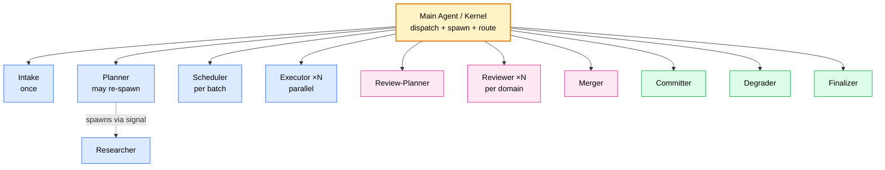
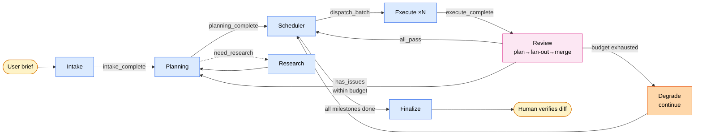
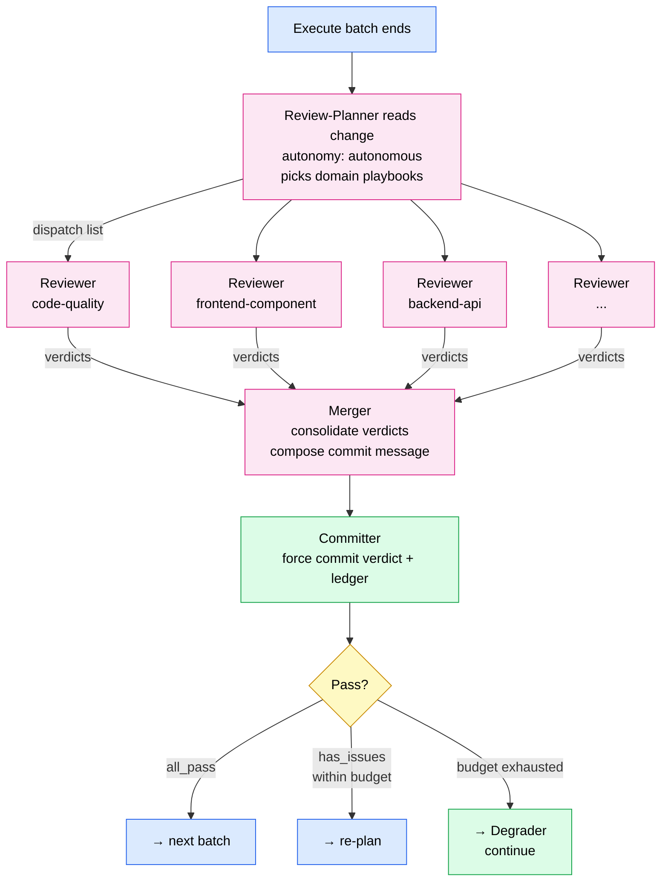
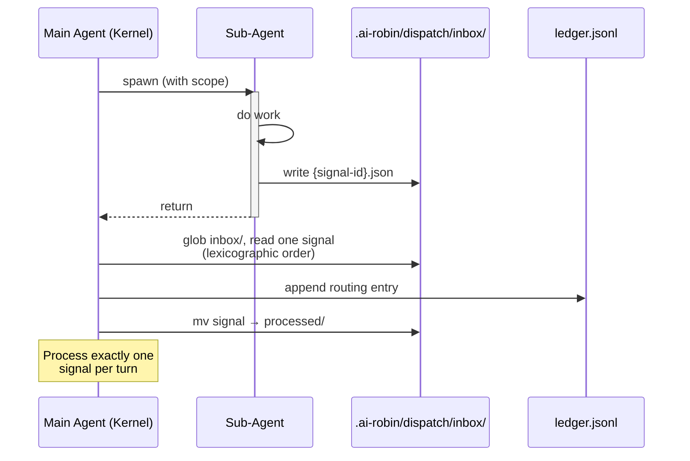

<p align="center">
  <a href="./DESIGN.md">English</a> | 简体中文
</p>

# Robin — 设计文档

> 一个 natural-language program (NLP)：接收一次性 human intake，跑完自主多智能体流程，端到端交付一个软件项目。

---

## 1. Thesis

Robin 押在一个赌注上：

> **Human 思考前置 + AI 长时间 running + Human 后置 verification** 比 **Human 在每一步做 tactical 决策** 更高产。

这是一个 P-vs-NP 式的直觉：verification 比 generation 便宜。只要前期 intake 做得足够好，agent framework 在 human 不在场的情况下，是可以把一个项目从 spec 推到 deliverable 的。

Robin 不是 helper、不是 copilot。它是一个 **batch job**：扔进去一个需求，几个小时后拿出一个项目。中间没有人。

---

## 2. 核心约束

整套设计由四个硬约束撑起来。

### 约束 1：只有一次 human 交互

整个 project lifecycle 里，human 只在 **Intake** 这一个 stage 里出现。Intake 结束后 human 就走了，直到最终 verify 项目产出。

含义：
- **Intake 是生死线。** 所有可能的决策点、所有可能的 gap、所有模糊性，必须在 Intake 阶段被识别、被问清楚、或被 Intake 代为钉死。
- **后续 agent 没有"停下来问"的 affordance。** 它们只有三个出路：自己做决策 / 回到前面的 stage re-plan / 触发 graceful degradation（把这部分标为未完成，继续别的）。
- **Planning / Execute / Review 都是自主的。** 它们依赖的所有信息必须已经在 Intake 阶段固化到 spec 里。

### 约束 2：Main agent 是 kernel，永远 light

Main agent 只做三件事：
1. **Parse stage transitions**（当前是哪个 stage、下一个是什么）
2. **Spawn sub-agents**（按 dispatch signal 创建 sub-agent，注入最小必要 context）
3. **Route return signals**（读 sub-agent 的 return signal，决定下一步）

Main agent **不做领域判断** —— 不评估代码好不好、不决定研究方向、不合成文档内容。所有实质工作在 sub-agent 里，main agent 的 context window 永远有余量处理意外。

实现方式：
- Sub-agent 不能自己 spawn sub-agent。Sub-agent 通过 **return signal** 告诉 main agent "我需要 X"，main agent 负责真正 spawn。
- 所有 state 都在 disk 上（spec yaml、session ledger、progress.yaml）。Main agent 每次 turn 开始只 load 必要的 state 切片。

### 约束 3：文档系统复用 Feature Room 的数据格式

Robin 写到 disk 的所有东西，**格式上兼容 Feature Room**：
- Spec 用 Feature Room 的 7 种 type（intent / decision / constraint / contract / convention / context / change）+ state 机制（draft / active / stale / deprecated / superseded）+ anchor + provenance / confidence。
- Room 目录结构：`room.yaml`、`specs/`、`progress.yaml`、`spec.md`。

但 Robin **不调用** Feature Room 的现有 skill（room-init、commit-sync、prompt-gen 等）。它自己的 `stdlib/` 抽取了这些 skill 的方法论（anchor tracking、confidence scoring、state lifecycle 等），用 Robin flavor 重写。

**为什么：** Feature Room 的 skill 假设了 "human 每一步都在线"（比如 commit-sync Phase 5 "等待用户确认"），这和约束 1 直接冲突。但 Feature Room 的**数据模型**是优秀的、可复用的，所以格式兼容、执行独立。

### 约束 4：Review 是 domain-specific 的

"Code review" 不是单一 agent 的单一任务。它是 **按 change 性质动态组合**的一组领域特定 review：
- 前端组件 review（component API、props、a11y、styling convention）
- 后端 API review（endpoint design、error handling、auth）
- DB schema review（索引、约束、迁移策略）
- Agent integration review（prompt quality、tool contract、error recovery）
- Code quality review（可读性、测试、文档）

Robin 的 Review 层是 **plan-then-fan-out** 的结构：
1. **Review-Planner** 看这次 change，决定要 spawn 哪些 reviewer sub-agent。
2. Main agent 并行 spawn N 个 reviewer，每个带自己的 **playbook**。
3. 每个 reviewer 产出结构化 verdict。
4. Merger 合并 verdict，决定 pass / fail。

Playbook 是 **build-time 从外部 skill packages 抽取**的。比如前端 review 的 playbook 是从 gstack 的前端 review skill 抽取、改写成符合 Robin flavor 的 sub-skill。Runtime 不动态加载外部 skill。

---

## 3. 整体架构

### 3.1 Agent 拓扑



三类 sub-agent：
- **Stage agents**（蓝色）驱动 pipeline：Intake → Planner → Scheduler → Executor，Researcher 作为 Planning 的辅助。
- **Review pipeline**（粉色）每个 Executor batch 之后跑一次：Review-Planner 选 playbook，多个 Reviewer 并行运行，Merger 合并。
- **Relief agents**（绿色）做 kernel 自己做不了的领域工作：Committer（用 Merger 写好的 message 执行 git commit）、Degrader（写降级叙述）、Finalizer（生成 end-of-run 交付总结）。

### 3.2 Stage lifecycle



文字说明：

- **Stage 0 — Intake。** 用户扔 raw input。Main agent spawn Intake。Intake 主动穷举决策点、识别 gap、问 user、把 decision 钉死到 spec、self-review 完整性。返回 `intake_complete`。**Human 此时退出。**

- **Stage 1 — Planning。** Main agent spawn Planner。Planner 读 Intake 的 spec，产出 decision / contract / constraint spec，识别模块边界 + API 契约，定义 milestone。返回 `planning_complete` / `need_research`（main agent spawn Researcher）/ `need_sub_planning` / `replan_budget_exhausted`（降级）。

- **Stage 2 — Scheduler。** Main agent spawn Scheduler。Scheduler 读 plan + 当前 progress，决定这一批的 milestone scope 和并发度（parallel / serial / mixed），按 `depends_on` 和 contract 约束。返回 `dispatch_batch` + N 个 executor 的 task spec。

- **Stage 3 — Execute。** Main agent 按 Scheduler 指令 spawn N 个 Executor。每个拉自己 scope 内的 context、写代码 + spec updates + change record，返回 `execute_complete` + artifacts reference。

- **Stage 4 — Review。** 所有 Executor 都结束后，main agent spawn Review-Planner。Review-Planner 看 change 性质（文件类型、anchor、contract spec），返回 `review_dispatch` + playbook list。Main agent 并行 spawn N 个 Reviewer；每个 load playbook + 相关 change，运行 checklist，产出 verdict。Main agent 调 Merger 合并 verdict。**强制 commit：** 不管 pass/fail，verdict 包都通过 Committer 写入并 commit，ledger append。然后：`all_pass` → 回 Scheduler；`has_issues` 在 budget 内 → 回 Planning；budget exhausted → Degrader 写叙述，继续 known issue。

- **Stage Done。** 所有 milestone 完成（或超 budget）。Finalizer 生成交付包：代码 + 最终 spec 状态 + session ledger + escalation notice（如有）。Human 回来做 final verification。

### 3.3 Return signals

每个 sub-agent 只能通过 **return 一个结构化 signal** 和 main agent 通信。Main agent 根据 signal type 决定下一步。

Sub-agent **不能**：
- 自己 spawn 其他 sub-agent
- 读其他 sub-agent 的 in-progress 输出
- 直接修改 session ledger（main agent 负责 append）

Sub-agent **必须**：
- 产出符合 [`contracts/dispatch-signal.md`](contracts/dispatch-signal.md) 的 return object
- 把所有 artifacts 写到约定路径（Feature Room Room 结构）
- 在 return 前写一个 session-ledger entry

---

## 4. 目录结构

```
AI-Robin-Skill/                         # 仓库根目录
├── README.md                           # 英文 README
├── README.zh-CN.md                     # 中文 README
├── DESIGN.md                           # 本文档（英文）
├── DESIGN.zh-CN.md                     # 本文档（中文）
├── LICENSE                             # MIT
├── ROBIN-LOGO.png                      # Logo
├── .claude-plugin/
│   └── plugin.json                     # Claude Code plugin manifest
├── commands/                           # Slash command 定义（plugin 注册）
│   ├── robin-start.md
│   ├── robin-resume.md
│   └── robin-status.md
├── agents/                             # Sub-agent wrapper（plugin 注册）
│   ├── robin-intake.md, robin-planner.md, robin-scheduler.md, robin-executor.md
│   ├── robin-researcher.md
│   ├── robin-review-planner.md, robin-merger.md
│   ├── robin-reviewer-code-quality.md  # 每个 reviewer domain 一个 wrapper
│   └── robin-committer.md, robin-degrader.md, robin-finalizer.md
├── skills/                             # Skill body（agent 通过 Read 加载）
│   ├── robin-kernel/
│   │   ├── SKILL.md                    # Main dispatch / routing 方法论
│   │   └── discipline.md               # Kernel 行为规范
│   ├── robin-intake/                   # Stage 0
│   │   ├── SKILL.md
│   │   ├── decision-taxonomy.md        # 项目类型 → 必须决策点
│   │   ├── question-prioritization.md  # 交互预算 + 问题排序
│   │   ├── completeness-check.md       # Return 前的 self-review
│   │   └── phases/
│   ├── robin-planner/                  # Stage 1
│   │   ├── SKILL.md
│   │   └── phases/
│   ├── robin-researcher/               # Planning 辅助
│   │   └── SKILL.md
│   ├── robin-scheduler/                # Stage 2
│   │   ├── SKILL.md
│   │   └── phases/
│   ├── robin-executor/                 # Stage 3
│   │   ├── SKILL.md
│   │   └── phases/
│   ├── robin-review-planner/           # Review：planner
│   │   └── SKILL.md
│   ├── robin-reviewer/                 # Review：通用 flow
│   │   ├── SKILL.md
│   │   └── domains/                    # 每个 domain 一个 .md
│   │       └── code-quality.md         # Always-spawn baseline
│   ├── robin-merger/                   # Review：verdict 合并
│   │   └── SKILL.md
│   ├── robin-committer/                # Git commit 执行（kernel relief）
│   │   └── SKILL.md
│   ├── robin-degrader/                 # 降级叙述作者
│   │   └── SKILL.md
│   └── robin-finalizer/                # End-of-run 交付总结
│       └── SKILL.md
├── hooks/                              # Plugin lifecycle hook
│   ├── hooks.json
│   ├── pre_task.py, post_task.py
│   ├── session_start.py
│   ├── stop.py, subagent_stop.py
│   └── lib/
├── contracts/                          # 跨 agent 数据契约
│   ├── dispatch-signal.md              # Sub-agent return → main agent
│   ├── session-ledger.md               # Append-only 决策日志
│   ├── stage-state.md                  # 当前 stage 表示
│   ├── review-verdict.md               # Reviewer 输出 schema
│   └── escalation-notice.md            # 交付包"未完成说明"
├── stdlib/                             # 共享方法论
│   ├── feature-room-spec.md            # Spec yaml 格式（从 Feature Room 复用）
│   ├── anchor-tracking.md              # (build-time from commit-sync)
│   ├── confidence-scoring.md           # (build-time from random-contexts)
│   ├── state-lifecycle.md              # Spec state 转换规则
│   ├── iteration-budgets.md            # Review / replan / research budget
│   └── degradation-policy.md           # Budget exhausted 后怎么办
├── docs/                               # 用户向参考文档
│   ├── architecture.md
│   ├── feature-room-mapping.md
│   ├── plugin-equivalence.md
│   └── review-stage-overview.md
└── tests/                              # Routing audit + end-to-end trace
    ├── routing-coverage.md
    └── end-to-end-trace.md
```

注意：
- **Kernel 入口是 `skills/robin-kernel/SKILL.md`**，而不是仓库根目录的 `SKILL.md`。Claude Code plugin 在 `/robin-start` 或 `/robin-resume` 触发时加载它。
- `agents/` 目录下的是 **wrapper**，plugin 系统把它们注册成 sub-agent。每个 wrapper 把自己加载的 body 指向 `skills/robin-{name}/SKILL.md`。
- Reviewer domain 是 `skills/robin-reviewer/domains/` 下**每个 domain 一个文件**。新增一个 domain 只需要一个新 `.md` + 一个新 `agents/robin-reviewer-{domain}.md` wrapper，不需要新建顶层 skill 目录。

---

## 5. 关键机制

### 5.1 Session ledger

所有 agent 的行为都留痕。Session ledger 是 append-only 的 jsonl 文件，放在项目的 `.ai-robin/ledger.jsonl`。

每条 entry 记录：
- 时间戳
- 哪个 agent / stage / iteration
- 产生了什么 artifacts（reference 到 spec id 或文件路径）
- 关键决策（what / why）

Human final verification 时，读 ledger 可以快速定位任何一个决策点。这把 verification 的成本从 O(deliverable 大小) 降到 O(决策数量)。

### 5.2 Budget & iteration

几个 hard budget，定义在 [`stdlib/iteration-budgets.md`](stdlib/iteration-budgets.md)：

| Budget | 默认值 | 触发时的行为 |
|---|---|---|
| Review on same content | 2 次 | 第 3 次 fail → degrade to known issue |
| Re-plan on same stage | 3 次 | 第 4 次 → degrade to known issue |
| Research depth | 2 层（research 可以触发 sub-research） | 第 3 层 → 用已有信息做决策 |
| Total wall-clock | 由 Intake 阶段确定 | 超时 → 暂停，等 human |
| Total token budget | 由 Intake 阶段确定 | 超时 → 暂停，等 human |

Budget 不是软约束，是硬 kill switch。任何 agent 在 return 前要 check budget。

### 5.3 Graceful degradation

当 budget 被 exhaust 时，系统**不 crash、不 escalate to human**（因为 human 不在），而是 **degrade gracefully**：

- 这部分工作标记为 `state: degraded`。
- Degrader 写一个 `context-degraded-*.yaml` spec，说明：目标是什么、尝试过什么、最后为什么放弃、当前状态是什么。
- 继续剩下的工作。
- 最终交付包里有一份 [`escalation-notice.md`](contracts/escalation-notice.md)，列出所有降级项。

Human final verify 时，看到降级清单，决定是自己接手修、还是再跑一轮 Robin、还是改需求。

### 5.4 Review stage：plan → fan-out → merge

这是整个架构里最复杂的一层，单独展开：



逐步说明：

1. **Execute batch 结束。** Main agent 通过 session ledger 读取这一批的 change artifacts。
2. **Review-Planner** 跑一次。看 change 性质：涉及哪些文件类型、哪些 anchor、哪些 contract spec。决定 dispatch list，比如：
   - `code-quality`（总是）
   - `frontend-component`（因为改了 `.tsx` 文件）
   - `backend-api`（因为改了 `/api/` 下的文件）
   - `agent-integration`（因为改了 prompt 或 tool 定义）
3. **Main agent 并行 spawn N 个 reviewer。** 每个独立：
   - Load 自己的 playbook（`skills/robin-reviewer/domains/{domain}.md`）。
   - Load 相关的代码和 spec。
   - 运行 playbook 的 checklist。
   - 产出 verdict：`{ status: pass | fail, issues: [...], severity: ... }`。
4. **Merger** 合并 verdict：
   - Any critical fail → overall fail。
   - Only minor warnings → overall pass with warnings。
   - All clean → overall pass。
   - 给 Committer 写好 commit message。
5. **Committer 强制 commit。** 不管 pass / fail，verdict 包都写到 Room 的 `specs/` 下作为一个 `change-review-{timestamp}-*.yaml` spec，commit 到 git，ledger append。
6. **决定下一步：**
   - `pass` → `ready_for_next_batch` 给 Scheduler。
   - `fail` 在 iteration budget 内 → `needs_rework` + issues → Planning。
   - `fail` budget exhausted → Degrader 写叙述；继续 known issue。

---

## 6. Build strategy

NLP 本身规模不小（25–40 个 markdown files）。开发顺序：

### 阶段 A：骨架（最先写）
1. `skills/robin-kernel/SKILL.md`（main dispatch）
2. `contracts/` 下所有 contract 定义
3. `skills/robin-kernel/discipline.md`
4. `stdlib/feature-room-spec.md`
5. `stdlib/iteration-budgets.md`
6. `stdlib/degradation-policy.md`

### 阶段 B：Stage agent 骨架
7. 每个 `skills/robin-{stage}/SKILL.md` 骨架，定义 return signal 和核心流程

### 阶段 C：每个 agent 的 stdlib depth
8. Intake 的 `decision-taxonomy.md` / `question-prioritization.md` / `completeness-check.md`
9. Planner 的 contract-design / parallelism-identification / replan-protocol 模块
10. Executor 的 context-pulling（build-time from prompt-gen）/ commit-preparation（build-time from commit-sync）

### 阶段 D：Reviewer domains（渐进）
11. `skills/robin-reviewer/SKILL.md`（generic review flow）+ `skills/robin-reviewer/domains/code-quality.md`（总是 spawn，必须先有）
12. 其他 domain 按需添加 —— 每加一个 domain，新增一个 `domains/{name}.md` + 一个 `agents/robin-reviewer-{name}.md` wrapper。

每个阶段跑完，**dog-food 在一个真实 mini project 上**找 gap。

---

## 7. 开放问题

这些问题在开发过程中会被逐步收紧：

1. **Intake 的交互预算到底是多少？** 3 轮 Q&A？10 个问题？需要实测。
2. **Researcher 的输出格式** —— structured findings（JSON）还是 markdown？倾向 markdown + 一个 summary spec。
3. **Executor 内部要不要递归？** 一个大 task 是否能 decompose 成 sub-task？目前设计：不递归，由 Scheduler 统一切分。
4. **Review playbook 的触发条件** —— 按文件扩展名？按 anchor 内容？需要一个明确的 trigger matcher 规范。
5. **跨项目的 learning** —— 不同项目之间有没有经验复用？目前不做，每个项目独立。

---

## 8. Runtime adaptation

Robin 是 **runtime-agnostic NLP**。架构上假设 sub-agent 通过共享 inbox（`.ai-robin/dispatch/inbox/{signal-id}.json`）和 main agent 通信。"通过 inbox 通信" 具体是什么意思取决于 runtime。

### 抽象参考模型



- Sub-agent 独立运行。结束时各自写一个 JSON signal 文件到 `.ai-robin/dispatch/inbox/`。
- Main agent 的 turn loop：
  1. 读 `stage-state.json`。
  2. 检查 inbox 是否有新 signal 文件。
  3. 处理 **一个** signal（lexicographic order；详见 [`skills/robin-kernel/discipline.md`](skills/robin-kernel/discipline.md)）。
  4. 把 signal 文件移到 `processed/`，append ledger，更新 state。
- "N 个并行 sub-agent" 的意思是：N 个 sub-agent 各写一个 signal 文件；main agent 跨 N 个 turn 一个一个处理。

### Claude Code 映射

Claude Code 的 `Task` tool 是**同步的**：调用它会跑完 sub-agent 并在同一个 parent turn 里返回结果。没有 "sub-agent 还在后台跑" 的异步状态。

在 Claude Code 里，参考模型可以干净地 collapse：

- **Sub-agent 工作：** main agent 调 `Task`。Sub-agent 的 SKILL 文件指示它在 return 前把 final signal 写到 `.ai-robin/dispatch/inbox/{signal-id}.json`。
- **"检查 inbox"：** main agent 在 sub-agent 返回的**同一个 turn 里**用 `Glob`/`Read` 读 `.ai-robin/dispatch/inbox/`。
- **并行 dispatch：** main agent 在**一条 message 里**发 N 个 `Task` tool call（Claude Code 并发跑）。每个 sub-agent 写自己的 signal 文件。N 个全部 return 后，main agent 在 inbox 里看到 N 个 signal。
- **Signal 顺序：** signal 文件全部到位后 main agent 才读；按 `signal_id` 字典序排，processing order 是确定的。

文件 inbox 在 Claude Code 里依然是权威通信通道。Sub-agent **不能** 只通过 `Task` 的 return value 传结构化数据 —— signal 文件才是 audit 的 source of truth。

### 其他 runtime

- **真正异步的 runtime（自定义编排循环）：** inbox 轮询在真异步工作之间触发。`active_invocations` 准确追踪 in-flight agent。Signal 顺序规则仍适用。
- **单线程、无并发的 runtime：** "N 个并行 agent" 优雅降级为 sequential execution。同一个 inbox、同一套 routing，只是慢一点。

### 跨 runtime 的不变量

- 每次 sub-agent invocation 一个 signal。
- Signal 在 `.ai-robin/dispatch/inbox/` 里以文件形式存在，直到被处理。
- Main agent 永远不把 sub-agent tool-return value 当作 signal 的权威来源 —— 只看 inbox 文件。
- Main agent 每个 routing action 处理一个 signal（详见 [`skills/robin-kernel/discipline.md`](skills/robin-kernel/discipline.md) §3），不管 inbox 里有多少。

如果某个 runtime 不能满足这些不变量（比如没有文件系统），需要一个 adapter 层。Robin 不打包这种 adapter —— v1 NLP 不管这个。

### Sub-skill 的注册和激活

Robin 的 sub-skill（`skills/robin-intake/SKILL.md`、`skills/robin-planner/SKILL.md` 等）**不能**作为顶层 user-invocable skill 注册。只有 kernel skill（`skills/robin-kernel/SKILL.md`）有 YAML frontmatter；所有 sub-skill 文件都不写 frontmatter，让 main agent 通过 `Read` tool 加载它们，runtime 不会把它们当成可被用户意图发现的独立 skill。

如果某个 runtime 的 skill discovery 机制不认 "无 frontmatter" 这个约定，可以把 sub-skill 文件改名（比如改成 `AGENT.md`）作为 runtime-specific 适配。Kernel skill 的内部引用相应更新。这纯粹是 runtime adapter 的事，不影响抽象设计。

---

## 9. 一句话总结

> **Robin 是一个 NLP runtime：Intake 是唯一的 human interface；main agent 是永远 light 的 kernel；Planner / Scheduler / Executor / Review 是按 stage 串起来的 stateless sub-agent；session ledger 是 append-only 的 audit log；Review 是按 change 性质动态 fan-out 的 domain-specific check；所有 state 以 Feature Room 格式写到 disk；graceful degradation 替代 human escalation。**
