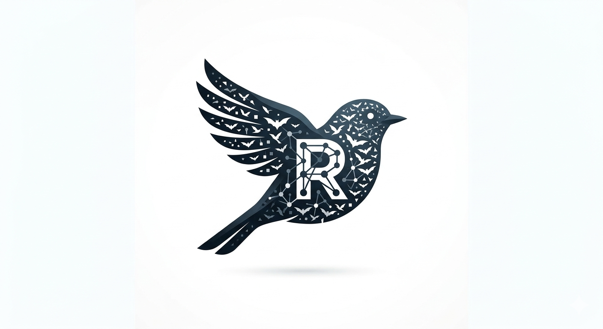
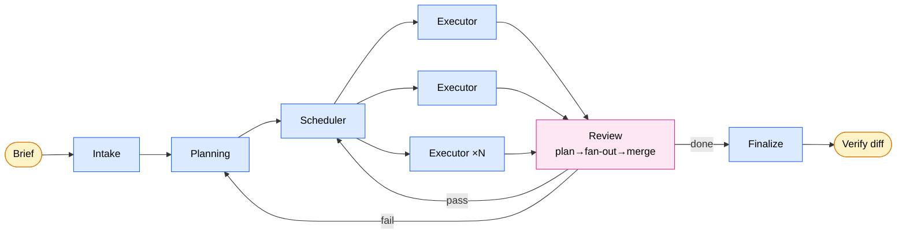

<p align="center">
  
</p>

<p align="center">
  English | <a href="./README.zh-CN.md">简体中文</a>
</p>

<p align="center">
  <a href="LICENSE"></a>
  <a href=".claude-plugin/plugin.json"></a>
  <a href="https://claude.com/product/claude-code"></a>
</p>

# Robin

> Drop a brief in. Walk away. Verify the diff.

Robin is an autonomous multi-agent workflow that takes a one-shot human brief and delivers a software project end to end. It runs as a Claude Code plugin: you spend 15–45 minutes on intake, then walk away for a multi-hour unattended run, then verify the diff.

**The bet:** generation is expensive, verification is cheap. If intake is good enough, the hours of execution between don't need you.

> Robin is a **batch job**, not a copilot. Do not use it for interactive pair-programming.

## Quick start

### Install from the marketplace (recommended)

Inside a Claude Code session:

```
/plugin marketplace add waynewangyuxuan/Robin
/plugin install robin@robin
```

`/robin-start`, `/robin-resume`, and `/robin-status` become available in every session. Claude Code auto-pulls updates from this repo's default branch on restart.

### Install for local development

If you're editing Robin itself and want changes to reflect live (no copy / no pin):

```bash
git clone https://github.com/waynewangyuxuan/Robin.git
cd Robin
source ./dev-install.sh             # adds `claude-robin` alias, active immediately
claude-robin                        # start Claude Code with Robin loaded from your source
```

After editing skills, agents, or hooks mid-session, run `/reload-plugins` to refresh without restarting. Uninstall the alias with `./dev-install.sh remove`.

### Commands

| Command | When |
|---|---|
| `/robin-start <brief>` | Begin a new run. Intake stage starts immediately. |
| `/robin-resume` | Continue a run interrupted mid-stage (auto-detects `.ai-robin/stage-state.json`). |
| `/robin-status` | Read-only inspection of current stage and ledger. |

## When to use Robin

| Good fit | Poor fit |
|---|---|
| Greenfield, medium-complexity (web app, CLI, API, agent app) | Highly fuzzy requirements that need exploratory iteration |
| Requirements expressible in ≤15 Q&A rounds | Strong stylistic preferences hard to articulate |
| You accept "some scope may be degraded" over "must be 100%" | Massive existing codebases needing deep context |
| Acceptance criteria are concrete (gate criteria) | Life-critical, financial, or legal production code |

## How it works



| Stage | Role |
|---|---|
| **Intake** | The only human-facing stage. Surfaces decisions, fills gaps, freezes spec. ≤15 Q&A budget. |
| **Planning** | Turns spec into milestones, module boundaries, API contracts. May spawn research. |
| **Scheduler** | Reads plan + progress; decides next batch's parallel/serial scope. Stateless. |
| **Executor ×N** | Parallel workers per Scheduler. Write code + spec updates. No inter-agent visibility. |
| **Review** | Review-Planner picks domain playbooks → N reviewers fan out → Merger consolidates. Always commits. |

Runtime state lives in `.ai-robin/`: `ledger.jsonl` (append-only audit), `dispatch/inbox/` (signal files between agents), `stage-state.json` (current stage), `META/` (Feature Room on disk).

## The 12 skills

| Cluster | Skills | Role |
|---|---|---|
| Kernel | `robin-kernel` | Main dispatch loop. Routes signals. Never reads domain content. |
| Stages | `robin-intake`, `robin-planner`, `robin-scheduler`, `robin-executor` | Pipeline stages. |
| Support | `robin-researcher` | Answers Planning's factual questions. |
| Review | `robin-review-planner`, `robin-reviewer`, `robin-merger` | Plan-fan-out-merge for domain-specific checks. |
| Relief | `robin-committer`, `robin-degrader`, `robin-finalizer` | Git ops, degradation narratives, delivery summaries — domain work the kernel can't do itself. |

## Runtime-agnostic

The source is a runtime-agnostic NLP. Agents communicate via a file-based inbox (`.ai-robin/dispatch/inbox/`); the Claude Code plugin is the first runtime adapter, mapping the abstract inbox to Claude Code's `Task` tool. See [`docs/plugin-equivalence.md`](docs/plugin-equivalence.md).

## Deep dive

| Doc | Scope |
|---|---|
| [`DESIGN.md`](DESIGN.md) | Full thesis, constraints, stage lifecycles, contracts, runtime abstraction. |
| [`docs/architecture.md`](docs/architecture.md) | One-page flow diagram and stage responsibilities. |
| [`docs/feature-room-mapping.md`](docs/feature-room-mapping.md) | What spec types and states Robin reuses from Feature Room. |
| [`docs/plugin-equivalence.md`](docs/plugin-equivalence.md) | Plugin contract with the abstract NLP. |
| [`docs/review-stage-overview.md`](docs/review-stage-overview.md) | Plan-fan-out-merge mechanics in depth. |

## License

[MIT](LICENSE) © 2026 waynewangyuxuan
