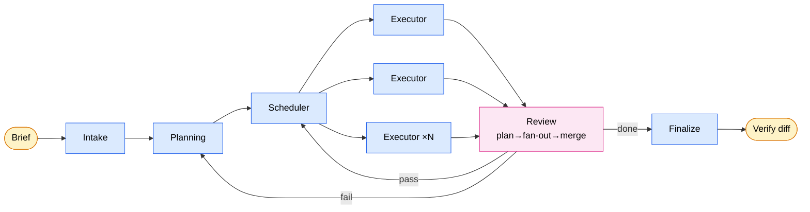

<p align="center">
  
</p>

<p align="center">
  <a href="./README.md">English</a> | 简体中文
</p>

<p align="center">
  <a href="LICENSE"></a>
  <a href=".claude-plugin/plugin.json"></a>
  <a href="https://claude.com/product/claude-code"></a>
</p>

# Robin

> 扔进去一个 brief。走开。回来 verify diff。

Robin 是一个跑在 Claude Code 上的自主多智能体工作流：把你的需求一次性讲清楚，它自主跑完 planning / execute / review 全流程，几个小时后产出一个项目，你回来 verify。

**核心赌注：** 生成贵，验证便宜。前期 intake 做好了，中间几个小时不需要你在场。

> Robin 是 **batch job**，不是 copilot。不适合 interactive pair-programming。

## 快速开始

Robin 还没发布到 plugin marketplace。推荐用 `./install.sh` 给你的 shell 装一个 `claude-robin` alias，等价于 `claude --plugin-dir <本仓库>`：

```bash
./install.sh                        # 给 shell rc 写入 `claude-robin` alias
source ~/.zshrc                     # 或者开个新终端
claude-robin                        # 起 session，Robin 已加载
```

源码改动实时生效 —— mid-session 跑 `/reload-plugins` 就刷新 skills / agents / hooks，不用重启。卸载：`./install.sh remove`。

不想装永久 alias 也可以直接跑：

```bash
claude --plugin-dir /path/to/AI-Robin-Skill
```

| 命令 | 用途 |
|---|---|
| `/robin-start <brief>` | 开始一个新 run，立刻进入 Intake stage。 |
| `/robin-resume` | 继续被中断的 run（自动检测 `.ai-robin/stage-state.json`）。 |
| `/robin-status` | 只读地查看当前 stage 和 ledger，不改 state。 |

## 适合 / 不适合

| 适合 | 不适合 |
|---|---|
| 中等复杂度从 0 到 1 项目（web app、CLI、API、agent app） | 极模糊、需探索式迭代的需求 |
| 需求能在 15 轮 Q&A 内讲清楚 | 风格偏好强但难言传 |
| 接受"部分 scope 可能 degraded"，而非要求 100% 完成 | 巨型代码库需深度上下文 |
| 有明确 acceptance criteria（gate criteria 表达） | 生命 / 金融 / 法律 production 代码 |

## 工作流



| Stage | 职责 |
|---|---|
| **Intake** | 唯一面向 human 的 stage。穷举决策点、填 gap、钉死 spec。≤15 轮 Q&A budget。 |
| **Planning** | 把 spec 转成 milestones、模块边界、API 契约。可触发 research。 |
| **Scheduler** | 读 plan + progress，决定下一批的并发度（parallel / serial / mixed）。无状态。 |
| **Executor ×N** | Scheduler 分发的并行 worker。写代码 + spec updates。互相不可见。 |
| **Review** | Review-Planner 选 domain playbook → N 个 reviewer 并行 → Merger 合并 verdict。无论 pass/fail 都强制 commit。 |

Runtime state 都在 `.ai-robin/`：`ledger.jsonl`（append-only 审计）、`dispatch/inbox/`（agent 间 signal 文件）、`stage-state.json`（当前 stage）、`META/`（Feature Room 落盘）。

## 12 个 skill 分布

| 集群 | Skill | 职责 |
|---|---|---|
| Kernel | `robin-kernel` | Main dispatch loop。Route signal。永远不读领域内容。 |
| Stages | `robin-intake`、`robin-planner`、`robin-scheduler`、`robin-executor` | Pipeline 各 stage。 |
| Support | `robin-researcher` | 回答 Planning 提的事实性问题。 |
| Review | `robin-review-planner`、`robin-reviewer`、`robin-merger` | Plan-fan-out-merge 的领域特定检查。 |
| Relief | `robin-committer`、`robin-degrader`、`robin-finalizer` | Git 操作、降级叙述、交付总结 —— kernel 做不了的领域工作。 |

## Runtime-agnostic

源码是 runtime-agnostic 的 NLP。Agent 之间通过文件 inbox（`.ai-robin/dispatch/inbox/`）通信；Claude Code plugin 是第一个 runtime adapter，把抽象 inbox 映射到 Claude Code 的 `Task` tool。详见 [`docs/plugin-equivalence.md`](docs/plugin-equivalence.md)。

## 深入阅读

| 文档 | 范围 |
|---|---|
| [`DESIGN.zh-CN.md`](DESIGN.zh-CN.md) | 完整 thesis、约束、stage lifecycle、contracts、runtime 抽象。 |
| [`docs/architecture.md`](docs/architecture.md) | 一页流程图与 stage 职责。 |
| [`docs/feature-room-mapping.md`](docs/feature-room-mapping.md) | Robin 复用 Feature Room 的 spec 类型与状态。 |
| [`docs/plugin-equivalence.md`](docs/plugin-equivalence.md) | Plugin 与抽象 NLP 的等价契约。 |
| [`docs/review-stage-overview.md`](docs/review-stage-overview.md) | Plan-fan-out-merge 机制深度展开。 |

## License

[MIT](LICENSE) © 2026 waynewangyuxuan
